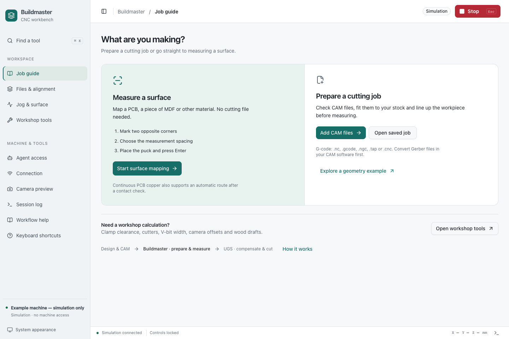
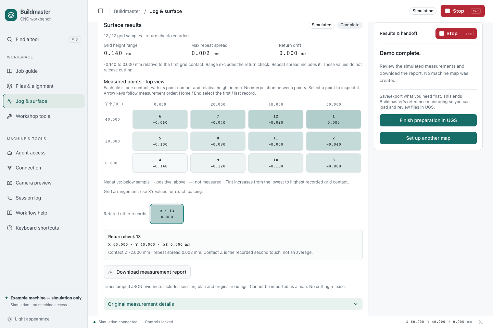

# CNC Buildmaster

**Prepare the job. Measure the surface. Continue in UGS.**

[](https://github.com/newtonlorenz/cnc-buildmaster/actions/workflows/test.yml)
[](LICENSE)

CNC Buildmaster gives you a visual workspace for the steps before a CNC cut.
You can inspect cutting files, position them on your material, and measure changes in surface height.
The app opens in your browser and runs on your own computer.

It is an early open-source project for desktop CNC users, with a focus on printed circuit boards (PCBs).
You can explore the demo without a machine.

[Try the demo](#try-it-without-a-machine) · [What it does](#tools-in-the-workbench) · [Machine setup](#use-your-own-machine) · [Report a problem](https://github.com/newtonlorenz/cnc-buildmaster/issues)



*The real app in demo mode. No machine was connected for this screenshot.*

## Why use it?

A cutting file describes where a CNC machine must move.
It does not tell you whether your material is in the right place or whether its surface is level.

For example, a small height difference can affect a shallow cut in a circuit board.
CNC Buildmaster helps you inspect the planned job and measure the surface before you continue in your cutting software.

The work stays visible: cutting paths, material boundaries, alignment points and the measurement route.
You can save a job package and return to its files later.
Saved files do not restore a valid physical machine reference.

## Tools in the workbench

| Tool | What you can do |
| --- | --- |
| **Job guide** | Follow the preparation stages, keep setup evidence and review the UGS handoff. |
| **Files & alignment** | Open cutting files, view their paths on the material, assign cutters and align the job with reference points. |
| **Surface mapping** | Define the area, plan the grid and measure the surface. Jog controls and measurement prompts stay in separate steps. |
| **Workshop tools** | Optional fixture checks, cutter observations, recipes, camera offsets and reviewed wood drafts. |
| **Camera** | Open a local live view. The camera does not measure position or control movement. |
| **Connection** | Check UGS and inspect your configured machine, puck height and permitted speeds. |
| **Session log** | Inspect recent events and saved-file details. |

The interface uses one React application with shadcn/ui components throughout: navigation, forms, controls, inspectors and dialogs. All assets are served locally.

The desktop layout keeps the work area beside the controls. Appearance follows
your operating system, with Light and Dark overrides. Use **Cmd/Ctrl+K** to find a
tool. Stop and machine coordinates remain visible on small screens.

For a rectangular map, record two opposite corners and check the two inferred
corners. Accept both in one action without travelling to them. Grid presets show
the exact placement count, including the return check. Wider spacing saves
placements but can miss surface variation; choose it for the cutting job.



*Surface results from a simulated scan. These readings do not describe a real workpiece.*

Choose the contact method for the material. A movable puck waits for your confirmation at every point. Continuous PCB copper uses a checked probe circuit and one explicit approval for the complete automatic route.
The machine takes two contacts, lifts the cutter and travels to the next point.
You stay at the machine throughout the process.

## Where it fits

**Design → create cutting files → prepare and measure in CNC Buildmaster → inspect and cut in UGS**

- **CAD** software creates the design.
- **CAM** software converts the design into cutting instructions, usually a G-code file.
- **CNC Buildmaster** helps you prepare those files and inspect the physical setup.
- **Universal Gcode Sender (UGS)** connects to the machine and sends the cutting job.

CNC Buildmaster uses UGS for its machine connection.
It does not replace your design software or generate cutting paths from a circuit-board design.
It does not send cutting jobs or apply height correction to exported cutting files. Copper scanning requires a checked circuit and explicit approval of the complete route.

An exported cutting file is a **draft for inspection in UGS**, not an approved machining job.

## Try it without a machine

The demo includes a rectangle example, simulated movement and simulated surface measurements.
You do not need UGS or a connected CNC machine to explore it.

### What you need

- A Mac for the currently supported setup.
- [Python](https://www.python.org/downloads/) 3.11 or later.
- [Node.js](https://nodejs.org/en/download) 22 or later, which includes `npm`.
- A web browser.

There is no packaged installer yet. The first setup uses Terminal, the macOS app for text commands.

### Open the demo

1. Download the project with GitHub's **Code → Download ZIP** button.
2. Extract the ZIP file.
3. Open Terminal.
4. Type `cd `, including the space.
5. Drag the extracted project folder into Terminal.
6. Press Return.
7. Enter these commands, one at a time:

```sh
npm ci
./cnc-map start --demo
```

`npm ci` downloads the software dependencies. The second command starts the demo.

8. Copy the local web address from Terminal into your browser.
9. Select **Explore a geometry example**, or choose **Start surface mapping**.
10. Explore the workspaces and utilities in the navigation.

The demo does not send commands to UGS. Its simulated measurements cannot become a machine height map.
Camera access starts only after you select **Enable camera** and grant browser permission.

To stop the demo, enter this command in the same project folder:

```sh
./cnc-map stop
```

<details>
<summary>Already familiar with Git?</summary>

```sh
git clone https://github.com/newtonlorenz/cnc-buildmaster.git
cd cnc-buildmaster
npm ci
./cnc-map start --demo
```

</details>

## Use with Codex or another AI agent

Buildmaster includes a JSON terminal interface and a local MCP server. Agents can
inspect a job, prepare files and save records. Machine actions appear for your
review in **Agent access**; puck-placement and contact confirmations stay with you.

```sh
./cnc-agent tools
./cnc-agent status
./cnc-agent job
```

Start the app first. The bridge reads private local credentials automatically and
does not take over the browser or keep a machine session alive. See the
[agent guide](docs/AGENTS.md) for MCP configuration, offline automation and examples.

## Prepare files without a machine

Use offline preparation to inspect real CAM files and save planning records.
It does not require a machine configuration, UGS or simulated movement.

```sh
./cnc-map start --offline
```

Open **Files & alignment** to inspect files and stock. **Workshop tools** keeps
optional planning records out of the normal preparation flow. Jobs are saved
separately in `data/offline-preparation/jobs` and can be downloaded as portable
packages. Reopen a package in a configured machine workspace to capture fresh
references. Offline mode cannot move, probe, import a map or export a live aligned
draft. Machine-dependent draft generation is also unavailable.

Use a different `--port` if another Buildmaster service is running. The launcher
will not silently change the mode of an existing server.

## Use your own machine

**Current machine integration: macOS, UGS Platform 2.1.26 and GRBL 1.1.**
GRBL is the software inside the supported machine controller.
Windows, Linux and other controllers need further integration and testing.

Machine setup currently needs more technical work than the demo.
It includes a machine configuration file and a compatibility-checked UGS extension, built with a Java development kit.
The extension provides the local connection and controlled hold-to-move commands.

1. Read the [configuration guide](docs/CONFIGURATION.md).
2. Enter your connection details, measured puck height and permitted speeds.
3. Complete the [UGS extension setup](docs/UGS.md).
4. Read the [operation guide](docs/OPERATION.md) before machine use.

The supplied example configuration cannot enable real machine control.
A different machine needs its own measured values and physical checks.

**Keep the physical stop within reach.** The browser Stop control depends on the software connection.
Software checks do not prove tool clearance, electrical safety or cutting accuracy.

## Common questions

**Does it need an account or cloud service?**

No account or cloud service is required for app operation. The app and UGS connection stay on your computer.
The initial dependency installation needs internet access.

**Does the camera record or upload video?**

No. The camera image stays in your browser.
Its crosshair is a visual aid. Workshop tools can calculate a camera-centre offset from entered fiducial measurements at one Z plane; this is a numerical check, not physical qualification.

**Which files can I open?**

Supported G-code files use `.nc`, `.gcode`, `.ngc`, `.tap` or `.cnc` extensions.
The command reader accepts a limited GRBL subset. A supported extension does not guarantee that every command is supported.
You can also reopen a saved job package.

**Can I change the configuration for my setup?**

Yes. The connection, puck height, movement speeds and storage location are configurable.
The [configuration guide](docs/CONFIGURATION.md) explains the fields and limits.

**Is it ready for unattended operation?**

No. An operator must remain at the machine. Puck scans require manual placement at each point. Continuous copper can be measured automatically after circuit checks and approval of the complete route.
This is an early project. Automated tests do not qualify a physical machine or cutting process.

## Documentation

- [Configuration](docs/CONFIGURATION.md) — machine details, speeds and storage.
- [UGS extension](docs/UGS.md) — connection setup and compatibility checks.
- [Operation](docs/OPERATION.md) — job preparation, movement and surface measurement.
- [Product review](docs/PRODUCT_REVIEW.md) — intended journeys, implemented fixes and release gates.
- [Agent guide](docs/AGENTS.md) — terminal commands, MCP and operator review.
- [Architecture](docs/ARCHITECTURE.md) — how the software components fit together.

## Get involved

You do not need to write code to contribute.
A clear problem report, a confusing label or a better explanation can improve the project.

- [Report a problem or suggest a feature](https://github.com/newtonlorenz/cnc-buildmaster/issues).
- Include your operating system, app version, expected result and actual result.
- Remove personal paths, credentials and private job files before you share a report.
- Read [Contributing](CONTRIBUTING.md) before a code change or pull request.

There are no promised dates for additional operating systems or controllers.
Specific setup details and reproducible reports help define that work.

<details>
<summary>Development and automated checks</summary>

```sh
npm ci
npm test
npm run test:browser

# After changing UI components:
npm ci --prefix scripts/cnc-map-ui
npm run build:ui
```

The browser checks need an installed Google Chrome.
Tests use simulated machine data and a generated camera image. They do not move a machine.

[View the automated check results](https://github.com/newtonlorenz/cnc-buildmaster/actions/workflows/test.yml).

</details>

## License and acknowledgments

CNC Buildmaster uses **GPL-3.0-or-later**. See the [license](LICENSE) for use, modification and distribution terms.

The machine integration builds on [Universal Gcode Sender](https://github.com/winder/Universal-G-Code-Sender).
Modified UGS source retains its original copyright notices.
See [third-party notices](THIRD_PARTY_NOTICES.md) for dependency information.

### Job guide and preparation tools

The Job guide uses locally bundled [AI Elements](https://elements.ai-sdk.dev/) Plan,
Task and Queue components with React. Optional forms live in Workshop tools. It follows the Mac appearance setting and
keeps Stop visible in the shared workbench shell. No AI service or API key is used.

- Derive scan coverage from placed cutting paths, effective tool diameters and a
  1 mm margin. Fresh alignment and an uncompensated source declaration are required.
- Inspect a declared tool/holder envelope against modelled clamps and travel bounds.
- Record tool-change observations, dated material recipes and measured outcomes.
- Calculate nominal V-bit width, prepare a dimensional coupon or a wood surfacing
  draft with explicit tool, material, workholding and machine reviews.
- Fit a camera-centre XY offset using two fiducials and an independent third check
  at the same Z. Board-flip assistance remains planning geometry.
- Import an accepted map into the open native UGS AutoLeveler and verify its actual
  grid by readback. This needs the rebuilt extension; see
  [native handoff](extensions/ugs/SURFACE_HANDOFF.md).

Recipe records and geometric checks do not qualify a cutting process. Draft
G-code is never sent by this app. Native import does not apply compensation or
verify material Z, physical reference continuity or a selected cutting file.
